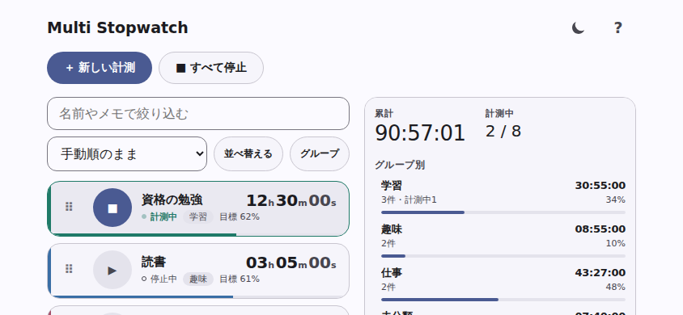

# Multi Stopwatch

複数のストップウォッチを同時に動かして、勉強や作業の積み重ねを記録するWebアプリです。
インストールすればオフラインでも使えます。記録は端末の中だけに保存され、どこにも送信されません。

インターフェースは日本語です。

## 今すぐ使う

**▶ https://masakiniwa.github.io/Multi-Stopwatch/**

登録もインストールも不要で、開いたらそのまま使えます。

[](https://github.com/MasakiNiwa/Multi-Stopwatch/actions/workflows/check.yml)
[](https://github.com/MasakiNiwa/Multi-Stopwatch/actions/workflows/pages.yml)
[](LICENSE)

## 画面

  



## できること

- **親子ストップウォッチ（セット）** — 子を折りたたんで一覧をコンパクトに。親に子の合計時間を表示し、同じセット内の計測をワンタップで切り替えます
- **簡単な削除と取り消し** — 削除モードで一覧から直接削除。直後は「元に戻す」で取り消せます（次の記録変更・再読み込みまで）
- **複数の同時計測** — 1件1行のコンパクトな一覧。390×844のスマートフォンで4件以上を一度に見渡せます
- **グループ** — 学習・仕事などに分類。グループを削除しても計測は消えず「未分類」へ移ります
- **並べ替え** — 名前・累計時間・状態・グループ・色・目標進捗の11条件で一括適用。適用後もドラッグや上下キーで微調整できます
- **絞り込み** — 名前やメモで検索（6件以上のとき表示）
- **統計** — 全体の累計、計測中の件数、グループ別の小計と割合、累計時間ランキング
- **目標** — 計測ごとに目標時間を設定し、進捗と達成を表示
- **オフライン対応** — 一度開けば通信なしでも起動します
- **レスポンシブ** — 縦長画面は「計測／統計」のタブ、横長で幅のある画面は左右に並べて表示
- **ライト / ダーク** — 初回は端末の設定に従い、ヘッダーのボタンで切り替えられます
- **バックアップ** — JSONで書き出し・読み込み

記録の単位は各計測の累計時間です。開始と停止の履歴はまだ保存していないため、日別・週別の集計はありません。

## 使い方

1. 「＋ 新しい計測」で名前をつけて追加します
2. 行の丸いボタンで開始・停止します。画面を閉じても、閉じていた時間を含めて再開します
3. 名前の部分を押すと詳細画面が開き、メモ・編集・リセット・並べ替え・削除ができます（セットの行は押すと子の表示・折りたたみになります）
4. 「グループ」で分類を作り、編集画面で割り当てます
5. ヘッダーの **?** ボタンにヘルプとバックアップ操作があります

### 親子で計測する

「＋ セット」で親を作ると、そのまま「＋ 子を追加」へ進めます。例：資格勉強 → テキスト／問題演習／復習。
セットの行は名前の先頭に ⌄ が付き、押すと子の表示と折りたたみが切り替わります。時間の前の「計」は子の合計という意味です。
同じセット内で子を開始すると前の子は停止します。別セットや単独計測との同時進行は可能です。
親の丸ボタンは、計測中なら停止、停止中なら最後に使った子を再開します。初回は子を選んでください。
子をセットから出すときは、子の詳細画面の「セットから出す」を押します（グループはそのまま残ります）。別のセットへ移すときは子の編集画面で所属を選びます。子のグループは親に従います。セット削除は子を残して単独化し、「子ごとすべて削除」は詳細画面から確認付きで行えます。
全体合計・個別ランキングは子と単独計測だけを数え、セットは別の小計として表示します。小計ではセットごとに上位3件の子と、そのセット内での割合が見られます。

削除の取り消しは直前の1件だけで、次に何か操作すると取り消せなくなります。計測中の項目を削除して取り消すと、削除していた間も含めて計測を継続します。長期の保護にはJSONバックアップを利用してください。

### 端末に追加する（PWA）

フッターに「オフラインで利用できます」と表示されたら、ブラウザのメニューから「インストール」または「ホーム画面に追加」を選ぶと、アプリのように単体で開けます。

すでにインストールしている場合、アイコンの更新はOS側のキャッシュの都合ですぐに反映されないことがあります。気になる場合は一度削除して追加し直してください。

## データとプライバシー

- 記録は**この端末のブラウザ内だけ**に保存します（`localStorage`）。サーバーへ送信しません。アカウントも解析も広告もありません
- ブラウザのデータを削除すると記録も消えます。**大切な記録はヘルプからバックアップ**してください
- バックアップはJSONファイルです。読み込みは現在の記録を置き換えます
- 端末の時計を変更すると計測に影響します
- 同じブラウザで複数のタブを開いた場合、編集できるのは最初の画面だけです（他は閲覧専用）

## 制約

- ストップウォッチ最大100件＋セット最大20件、1計測あたり10年まで。親の小計は子の合計です
- 目標に到達しても自動停止や通知はしません
- 端末間の同期はありません
- 競技用の精密計測ではなく、作業・学習時間の記録向けです
- 初回アクセスには通信が必要です

## 開発

利用時にビルドは不要です（`public/` をそのまま配信します）。テストと開発ツールにはNode.js 24以降が必要です。

```sh
npm ci                 # 開発・テスト用の依存（Playwright）を入れる
npm start              # http://localhost:8080 でプレビュー
npm test               # Node.jsのユニットテスト
npm run test:browser   # Playwrightのブラウザテスト
```

ファイルを直接開かず、HTTPサーバー経由で表示してください（Service Workerとモジュール読み込みのため）。

### 構成

```
public/            配信するファイルはこれだけ
  index.html       画面の構造
  style.css        Material 3 inspired のデザイントークン
  manifest.webmanifest
  sw.js            オフライン用Service Worker
  icons/           icon.svg / icon-maskable.svg が原本、PNGはそこから生成
  src/
    model.js       計測・グループの純粋関数、保存schemaと移行
    stats.js       集計（純粋関数）
    sorting.js     一括並べ替え（純粋関数）
    storage.js     localStorageの読み書き契約
    ui.js          描画とダイアログ
    app.js         状態・操作・イベントの接続
tests/             Node.jsのユニットテスト
scripts/           Playwrightのブラウザテスト
docs/              設計・検証記録・スクリーンショット
```

集計・並べ替え・schema移行はDOMから切り離した純粋関数にしてあり、ユニットテストで仕様を固定しています。外部のUIフレームワークやランタイム依存はありません。

### 自動テストと公開

- `main` と Pull Request で **Checks**（ユニットテスト＋Playwright）が動きます
- `main` への push で **Deploy Pages** が GitHub Pages へ自動公開します

## これから

実際に使って感じた不便から順に直していく方針です。

- [Roadmap（次期改善候補）](https://github.com/MasakiNiwa/Multi-Stopwatch/issues/10)
- [親子ストップウォッチの設計記録](https://github.com/MasakiNiwa/Multi-Stopwatch/issues/8)

## フィードバック

不具合や要望は [Issues](https://github.com/MasakiNiwa/Multi-Stopwatch/issues) へお寄せください。

元になったFlutter版：[SimpleMultiStopwatch](https://github.com/MasakiNiwa/SimpleMultiStopwatch)

## ライセンス

[MIT License](LICENSE)

---

開発者向けの記録：[設計](docs/design.md) ／ [検証記録](docs/acceptance.md) ／ [引き継ぎ](docs/handoff.md) ／ [協業ルール](AGENTS.md)
