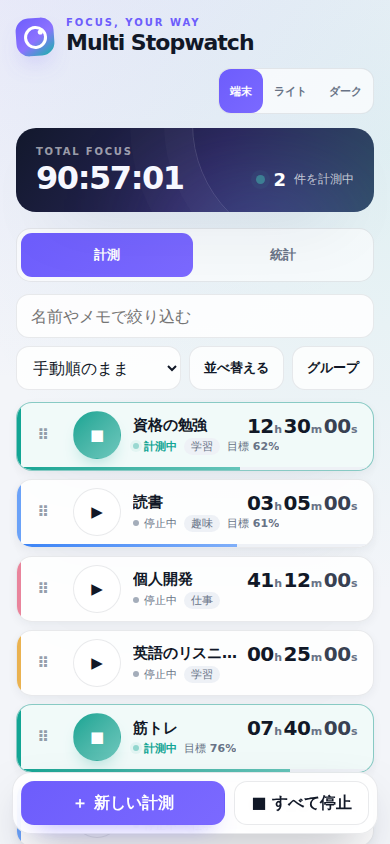
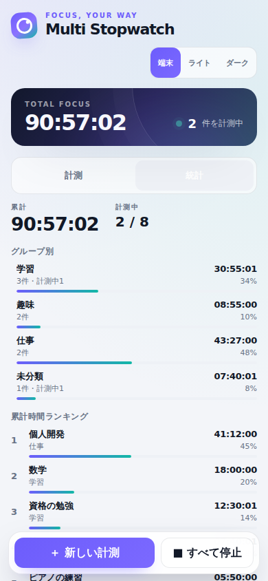
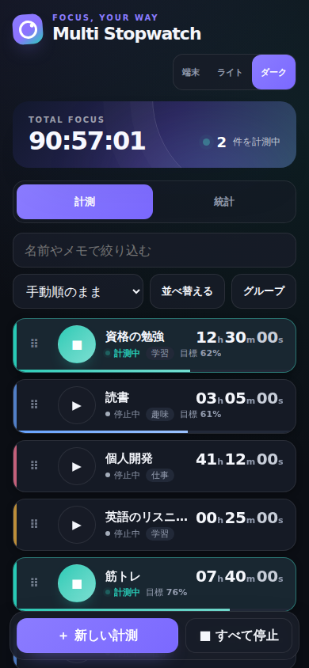
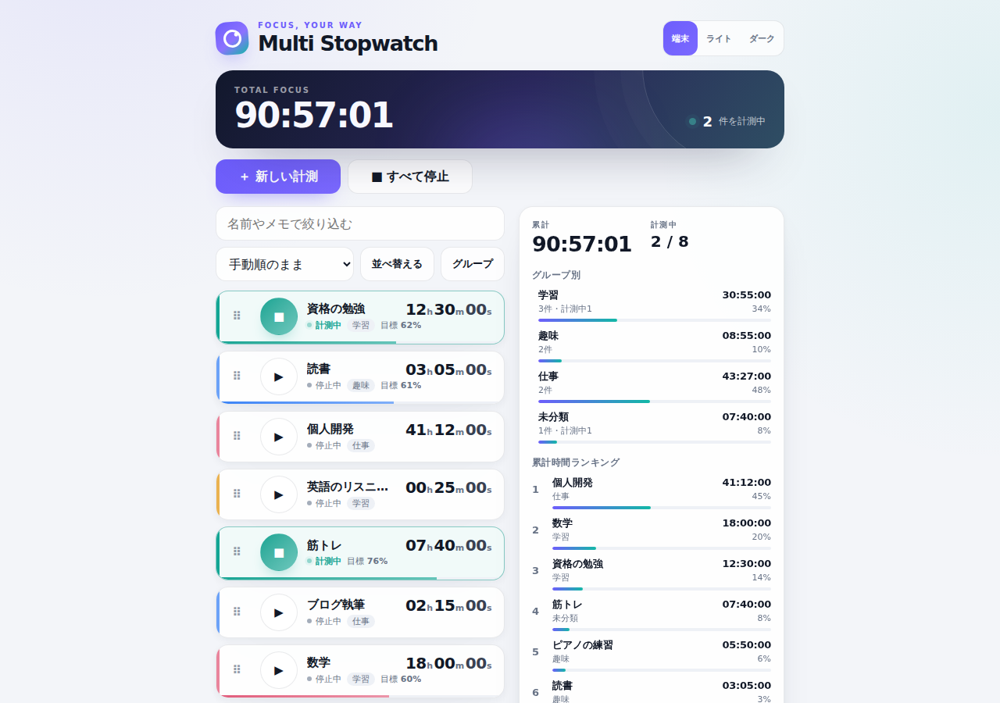

# Multi Stopwatch

学習や作業の積み重ねを残す、オフライン対応のマルチストップウォッチ。
Flutter版 [SimpleMultiStopwatch](https://github.com/MasakiNiwa/SimpleMultiStopwatch) を参考に、HTML / CSS / JavaScriptで作り直すプロジェクトです。

**現在：v0.5 グループ・一括並べ替え・統計を実装、ChatGPTのレビュー待ちです。公開中のv0.4の後継になります。**

▶ [Multi Stopwatchを開く](https://masakiniwa.github.io/Multi-Stopwatch/)

  




## 現在使えること

- 複数の独立したストップウォッチ、開始・停止、一括停止
- 1件1行のコンパクト一覧。390×844のスマホで4件以上をそのまま見渡せます
- **グループ**で計測を分類。グループを削除しても計測は消えず「未分類」へ移ります
- **一括並べ替え**（名前・累計時間・状態・グループ・色・目標進捗の11条件）。適用後もドラッグや上下キーで微調整できます
- **統計**：全体の累計、計測中の件数、グループ別の小計と割合、累計時間ランキング
- 縦長画面は「計測／統計」のタブ、横長で幅のある画面は一覧と統計を左右に並べて表示
- 名前やメモでの絞り込み（6件以上で表示）
- ドラッグ・上下キー・詳細画面のボタンで並べ替え
- 名前・メモ・4色、目標時間と達成表示、時/分/秒での経過時間の修正
- 「端末に合わせる／ライト／ダーク」のテーマ選択。選択は端末内に保存
- 操作直後の自動保存、閉じている間を含めた計測復元
- JSONバックアップ・復元（読み込みはv1/v2の両方に対応）、複数画面の同時編集防止
- キーボード操作、読み上げラベル、44px以上のタップ領域
- PWAインストール用manifest、オフライン起動用Service Worker

行の名前部分を押すと、メモ・編集・リセット・並べ替え・削除をまとめた詳細画面が開きます。

統計は、各計測が今持っている累計時間を集計したものです。セッション履歴はまだ記録していないため、日別・週別の集計はありません。

## 開発

Node.js 24以降、Python 3。npmの依存インストールやビルドは不要です。

```sh
npm test
npm start
npm run test:browser # Playwrightとブラウザ導入後
```

ブラウザで http://localhost:8080 を開きます。HTMLファイルの直接起動ではなくHTTPサーバーを使用してください。
配信対象は `public/` のみ。ローカル計測データはGitHubへ送信しません。

`public/src` は役割ごとに分かれています。`model.js`（計測とグループの純粋関数、schema移行）、`stats.js`（集計）、`sorting.js`（一括並べ替え）、`storage.js`（保存契約）、`ui.js`（描画とダイアログ）、`app.js`（状態と操作の接続）。
`npm test` は `model.js` と `storage.js` を対象にしたNode.jsのテストです。`npm run test:browser` はPlaywrightで一覧の密度・タップ領域・並べ替え・テーマ保存・オフライン起動を確認します。

計測データは `multi-stopwatch:state:v1`、テーマなどの表示設定は `multi-stopwatch:prefs:v1` と別のキーに保存します。設定が壊れていても計測データには影響しません。
計測データのschemaはv2です。キー名は記録の名前で、schemaの版は値の中の `version` が持ちます。v1の記録は読み込み時にv2へ移行し（既存の計測は「未分類」）、次の保存でv2として書かれます。

## 公開と端末への追加

1. レビュー後にmainへマージ。
2. GitHubの Settings → Pages → Source を **GitHub Actions** に設定。
3. Actions → **Deploy Pages** → **Run workflow**（main）を実行。
4. 成功後、ワークフローが表示する公開URLを開く。
5. 「オフラインで利用できます」を確認。対応ブラウザの「インストール」または「ホーム画面に追加」を使う。

初期設定では意図しない公開を避けるため手動デプロイです。初回公開後、自動公開にする場合は `pages.yml` にmainへのpushトリガーを追加できます。
相対パス設計のため `/Multi-Stopwatch/` のようなプロジェクト配下にも配置可能です。
更新は全アプリ画面を閉じて再度開くと反映されます。配信ファイル変更時は `sw.js` のVERSIONを更新してください。

## 制約

- 初回アクセスは通信が必要。キャッシュやサイトデータが消去された場合も再接続が必要です。
- 閉じている間は常駐処理せず、端末時刻の差分で復元。端末時刻の手動変更・補正は計測に影響します。
- 目標到達時のバックグラウンド通知、自動停止、端末間同期はありません。
- ブラウザ単位の保存です。インストール前後の共有状況もブラウザに依存します。大切な記録はバックアップしてください。
- Web Locks対応ブラウザで編集できます。複数画面では最初の画面だけ編集可能。他を閉じた後、再読込で編集権を取得します。
- 上限100件、各計測10年。競技用の精密計測ではなく作業・学習時間向け。
- 元Flutter版からデータを直接移行する機能は未実装。

## 引き継ぎ

[設計と旧版分析](docs/design.md) → [Claudeへの引き継ぎ](docs/handoff.md) → [検証項目](docs/acceptance.md) の順で読んでください。
`AGENTS.md` と `CLAUDE.md` に協業ルールがあります。既存LICENSE（MIT）を継承しています。
